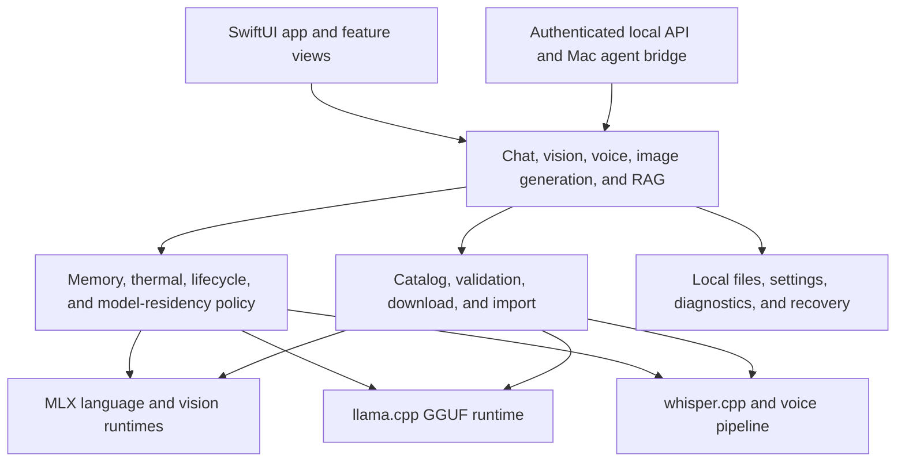
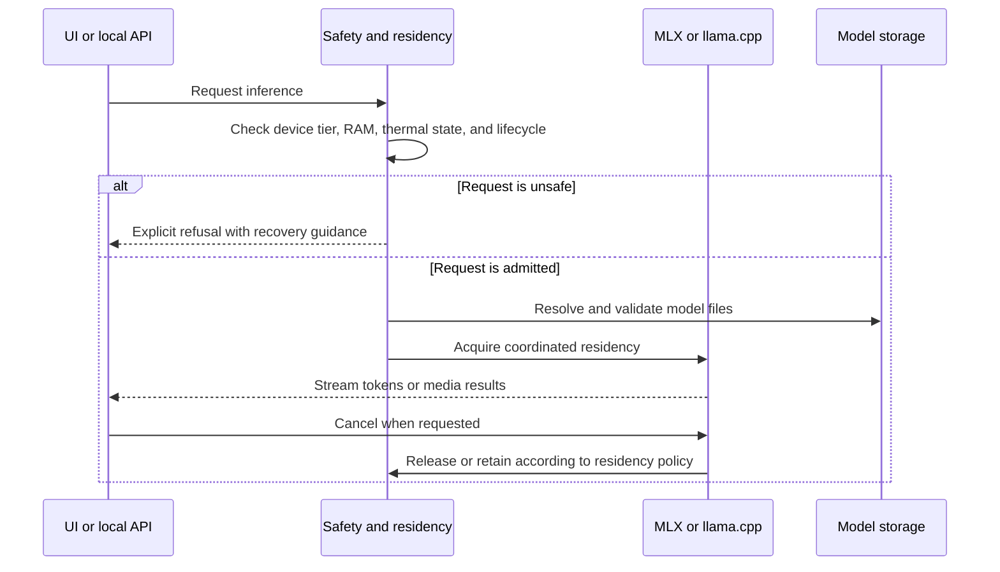

# iOS Local LLM architecture

This map is for developers who want to understand iOS Local LLM or reuse part of
it in another local-LLM iOS app. For a file-by-file extraction guide, see
[Reusable components](Docs/REUSABLE_COMPONENTS.md).

## System layers

The central design rule is that heavy runtimes do not load independently.
Admission, residency, memory pressure, thermal state, cancellation, and app
lifecycle are coordinated before inference begins.

## Source tree

| Path | Role |
| --- | --- |
| `IOSLocalLLM/Views/` | SwiftUI screens and reusable presentation components |
| `IOSLocalLLM/Services/` | Product services, runtimes, safety policy, downloads, diagnostics, and bridges |
| `IOSLocalLLM/Models/` | Shared app types, model metadata, catalogs, and settings |
| `IOSLocalLLM/LocalAIRuntimeFoundation/` | Small runtime abstractions and utilities; currently compiled into the app target |
| `IOSLocalLLM/Services/Bridge/` | Local OpenAI/Anthropic/Ollama routes and paired Mac-agent protocol |
| `IOSLocalLLMTests/` | Unit, policy, decoding, lifecycle, and service tests |
| `Packages/VoiceAgentOrb/` | Independently buildable Swift package |
| `ThirdParty/llama.cpp/` | Upstream llama.cpp submodule |
| `ThirdParty/whisper.cpp/` | Upstream whisper.cpp submodule |
| `project.yml` | Source of truth for generated Xcode project configuration |

## Inference lifecycle

## Subsystem ownership

| Concern | Primary implementation | Representative tests |
| --- | --- | --- |
| Device capability and admission | `DeviceTierAdvisor.swift`, `MemoryAdvisor.swift` | `DeviceTierAdvisorTests.swift` |
| Thermal and runtime safety | `DeviceSafetyMonitor.swift`, `ModelResidency.swift`, `LifecycleController.swift` | safety and high-risk service tests |
| Model search and download | `HFSearchService.swift`, `HFModelDownloadManager.swift`, `ModelDownloadCenter.swift` | `HighRiskServiceTests.swift` |
| MLX inference | `CodingAssistantService.swift`, `MLXGenerationGate.swift` | local-runtime and model-category tests |
| GGUF and llama.cpp | `LlamaCppBridge.swift`, `LlamaCppVLMService.swift` | local-runtime foundation tests |
| Local API and tools | `Bridge/LocalAPIServer.swift`, `Bridge/ToolRunner.swift` | `LocalAPIServerTests.swift` |
| Retrieval | `KnowledgeBaseService.swift`, `OnDeviceEmbedder.swift` | local-runtime foundation tests |
| Diagnostics and recovery | `Diagnostics.swift`, `CrashReporter.swift`, `SystemStatusService.swift` | `DiagnosticsTests.swift` |

Exact paths, dependencies, portability notes, and suggested extraction order
are in [Docs/REUSABLE_COMPONENTS.md](Docs/REUSABLE_COMPONENTS.md).

## Reuse boundaries

iOS Local LLM is an application, not a single SDK. Its code falls into three
practical reuse levels:

1. **Extractable** — small Foundation-oriented types that can move into a
   Swift package with little or no change.
2. **Adaptable** — useful subsystems whose policy is reusable but whose app
   models, UIKit notifications, persistence, or logging need adapters.
3. **Integrated** — full product services tied to MLX, llama.cpp, the app
   service graph, or UI state. Use these as reference implementations or
   refactor them behind your own interfaces.

The catalog labels every listed component with one of these levels. A file
being MIT-licensed does not mean it is dependency-free or safe to copy without
its invariants and tests.

## Non-negotiable invariants

- All heavy model loads pass through memory, thermal, and residency policy.
- Local inference never silently falls back to a cloud service.
- Backgrounding, memory pressure, thermal escalation, and cancellation lead
  to deterministic cleanup.
- Model files are validated before a runtime opens them.
- API and Mac-agent access remain opt-in and authenticated.
- Credentials, prompts, captured media, and user documents are not logged.
- Model weights keep their own licenses and are not covered by this
  repository's MIT license.
