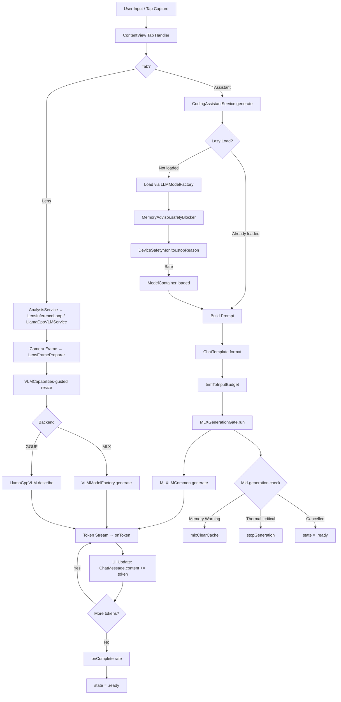

# Local LLM Foundation Handoff

> **Target:** Build a new app from iOS Local LLM' strongest foundations.
> **Generated:** 2026-06-18
> **Source codebase:** iOS Local LLM v3.0.1 (`<repo-root>`)
> **Deployment target:** iOS 18.0
> **Swift version:** 5.10
> **Package manager:** Swift Package Manager (`project.yml` / XcodeGen)

---

## 1. Project Map

The app is a single-target iOS application with optional Mac Catalyst support. It is structured as a standard Xcode project generated from `project.yml` (XcodeGen). The share extension `IOSLocalLLMShareExtension` exists but was not inspected in depth — it handles image sharing into the main app.

### Source Tree Overview

```
IOSLocalLLM/
├── IOSLocalLLMApp.swift              ← @main entry point, app delegate, scene phase handling
├── ContentView.swift              ← Tab-based navigation (Home/Assistant/Lens/Voice/Models)
├── Models/
│   ├── AppSettings.swift          ← @AppStorage-backed user preferences hub
│   ├── AssistantModelCatalog.swift← Curated preset list of text LLMs (Qwen3, Llama, Phi, Gemma)
│   ├── ChatMessage.swift          ← Message identity (user/assistant/system), image attachments
│   ├── ChatTemplate.swift         ← Per-family prompt format (ChatML, Llama3, Gemma, Phi)
│   ├── ConversationStore.swift    ← Codable conversation CRUD → conversations.json
│   ├── ModelCatalogTypes.swift    ← Shared enums (Capability, Runtime, Vendor, Family)
│   └── ...                        ← FastVLM config, LoRA, Persona, Voice models, etc.
├── Services/
│   ├── CodingAssistantService.swift  ← Text LLM load/generate via mlx-swift-lm
│   ├── FastVLMService.swift          ← FastVLM pipeline (Core ML encoder + MLX decoder)
│   ├── LensInferenceLoop.swift       ← Lens VLM container owner + one-shot describe
│   ├── LlamaCpp/LlamaCppVLMService.swift ← GGUF VLM path via llama.cpp + mtmd
│   ├── MLXGenerationGate.swift       ← Actor-based serial gate for all MLX GPU work
│   ├── MemoryAdvisor.swift           ← RAM budget, per-model footprint, load gates
│   ├── ModelResidency.swift          ← Dual-model coexistence decision + prefetch
│   ├── DeviceSafetyMonitor.swift     ← Thermal, low-power, memory warning tracking
│   ├── DeviceTierAdvisor.swift       ← Device classification by RAM, tier defaults
│   ├── ModelDownloadCenter.swift     ← Downloadable model catalog + download lifecycle
│   ├── HFModelDownloadManager.swift  ← Per-repo resumable HuggingFace downloader
│   ├── BackgroundDownloadCoordinator.swift ← Background URLSession + resume data
│   ├── ModelCacheProbe.swift         ← "Is this directory a usable model?" check
│   ├── LocalModelImportService.swift ← Files.app → HFModels import flow
│   ├── HFTokenStore.swift            ← Keychain-backed HF access token
│   ├── VLMCapabilities.swift         ← VLM input sizing/normalization strategy tables
│   ├── OnDeviceCompatibility.swift   ← HF repo classification (format, family, size)
│   ├── AnalysisService.swift         ← Orchestrates camera capture → VLM/OCR pipeline
│   ├── LensFramePreparer.swift       ← Image preprocessing for VLM input
│   ├── CameraService.swift           ← AVCaptureSession lifecycle
│   ├── Bridge/                       ← LocalCoderBridge (Mac pairing, LAN inference)
│   │   ├── BridgeManager.swift
│   │   ├── BridgeServer.swift
│   │   ├── HubApiDownloader.swift    ← MLXLMCommon Downloader protocol bridge
│   │   └── ...
│   ├── Diagnostics/
│   │   ├── CrashReporter.swift       ← Signal/exception/unclean-exit detection
│   │   ├── Diagnostics.swift         ← Rolling breadcrumb disk log
│   │   └── SystemSnapshot.swift
│   ├── RAG/
│   │   ├── KnowledgeBaseService.swift← On-device chunk+embed+retrieve (cosine sim)
│   │   └── OnDeviceEmbedder.swift
│   ├── Voice/                        ← TTS engines (Kokoro, KittenTTS, System), STT, narrator
│   ├── Web/                          ← Web search pipeline, content extraction
│   └── ...                           ← ToolRunner, ImageGeneration, Benchmark, etc.
├── Views/                            ← SwiftUI views (tabs, pickers, settings, etc.)
├── ViewModels/
├── Vendor/StableDiffusion/           ← Vendored patched SD for multi-model configs
└── Resources/                        ← Bundled tokenizers, preprocessor configs, TTS voices
```

### Key Files Table

| Area | File/Path | Main Types | Purpose | Reusable? |
|------|-----------|------------|---------|-----------|
| Entry | `IOSLocalLLMApp.swift` | `IOSLocalLLMApp`, `AppDelegate` | App bootstrap, scene-phase GPU cancellation, crash reporter install | Partially |
| Nav | `ContentView.swift` | `ContentView` | Tab-based routing, cross-tab model unload orchestration | No (app-specific UI) |
| Settings | `IOSLocalLLM/Models/AppSettings.swift` | `AppSettings` | @AppStorage-backed settings hub (~60 keys) | Yes, as pattern |
| Model Catalog | `Models/AssistantModelCatalog.swift` | `AssistantModelCatalog`, `AssistantModel` | Curated text LLM presets (15 models) | Yes |
| Chat | `Models/ChatMessage.swift` | `ChatMessage` | Message model with attachments, streaming state | Yes, core |
| Chat TMpl | `Models/ChatTemplate.swift` | `ChatTemplate` | Per-family prompt formatting (ChatML, Llama3, Gemma, Phi) | Yes, core |
| Conv. Store | `Models/ConversationStore.swift` | `ConversationStore`, `StoredConversation` | Codable conversation CRUD with pagination | Yes, core |
| LLM Service | `Services/CodingAssistantService.swift` | `CodingAssistantService` | Text LLM load/generate/switch via MLX | Yes, high value |
| VLM Loop | `Services/LensInferenceLoop.swift` | `LensInferenceLoop` | VLM container owner + describe pipeline | Yes, high value |
| FastVLM | `Services/FastVLMService.swift` | `FastVLMService` | Built-in FastVLM pipeline | Yes, specific |
| GGUF VLM | `Services/LlamaCpp/LlamaCppVLMService.swift` | `LlamaCppVLMService` | llama.cpp + mtmd VLM path | Yes |
| GPU Gate | `Services/MLXGenerationGate.swift` | `MLXGenerationGate` | Actor-serialized MLX GPU command submissions | Yes, critical |
| RAM Advisor | `Services/MemoryAdvisor.swift` | `MemoryAdvisor` | Footprint estimates, per-process ceiling, load gates | Yes, critical |
| Residency | `Services/ModelResidency.swift` | `ModelResidency` | Dual-residence budget, background weight prefetch | Yes |
| Thermal | `Services/DeviceSafetyMonitor.swift` | `DeviceSafetyMonitor` | Thermal/LPM/memory-warning tracking + token caps | Yes, critical |
| Tier | `Services/DeviceTierAdvisor.swift` | `DeviceTierAdvisor` | Device RAM classification, tier defaults | Yes |
| Downloads | `Services/ModelDownloadCenter.swift` | `ModelDownloadCenter`, `DownloadableModel` | Downloadable catalog + lifecycle | Yes |
| HF DL | `Services/HFModelDownloadManager.swift` | `HFModelDownloadManager` | Per-repo resumable HuggingFace download | Yes, high value |
| Bg DL | `Services/BackgroundDownloadCoordinator.swift` | `BackgroundDownloadCoordinator` | Background URLSession + resume data | Yes |
| Import | `Services/LocalModelImportService.swift` | `LocalModelImportService` | Files.app → HFModels import with validation | Yes |
| Token | `Services/HFTokenStore.swift` | `HFTokenStore` | Keychain-backed HF access token | Yes |
| Cache Probe | `Services/ModelCacheProbe.swift` | `ModelCacheProbe` | "Is directory usable?" (config + weights + shards) | Yes, core |
| VLMCaps | `Services/VLMCapabilities.swift` | `VLMCapabilities` | VLM input sizing strategies + normalization | Yes |
| Compat | `Services/OnDeviceCompatibility.swift` | `OnDeviceCompatibility` | HF repo classification for runnability | Yes |
| RAG | `Services/RAG/KnowledgeBaseService.swift` | `KnowledgeBaseService` | On-device chunk/embed/retrieve | Yes |
| Crash | `Services/Diagnostics/CrashReporter.swift` | `CrashReporter` | Signal/exception/unclean-exit detection + breadcrumbs | Yes |
| Chat TMpl | `Services/Bridge/HubApiDownloader.swift` | `HubApiDownloader` | MLXLMCommon Downloader protocol bridge | Yes |
| Web Search | `Services/Web/WebSearchService.swift` | `WebSearchService` | On-device web search pipeline | Yes |

---

## 2. App Foundation Summary

### What the app fundamentally does
iOS Local LLM is a local AI workbench for iPhone. All inference runs on-device — no cloud LLM dependency. The app supports:
- **Text chat** with user-selectable on-device LLMs (Qwen3, Llama 3.2, Phi-3.5, Gemma 2, etc.) via Apple MLX
- **Camera-based image analysis** (the "Lens" tab) using VLMs (FastVLM, SmolVLM2 GGUF, Qwen3-VL)
- **On-device RAG** (Knowledge Base) — embed documents locally, retrieve via cosine similarity
- **Voice conversation** with STT (Apple/Whisper) + LLM + TTS (Kokoro/KittenTTS/system)
- **Image generation** via Stable Diffusion (vendored)
- **Web search** pipeline (fetch, extract, compress, inject into context)
- **Mac pairing** (LAN bridge for coding assistance)

### How local AI models are represented
- **Text LLMs:** `AssistantModel` structs in `AssistantModelCatalog.presets`, identified by a stable `id` (e.g., `"qwen3-4b-2507"`) and a HuggingFace `repoID`. Models are loaded via mlx-swift-lm's `LLMModelFactory`.
- **VLMs:** Either the built-in FastVLM (Core ML encoder + MLX decoder) identified by `FastVLMService.modelID` (`"fastvlm-mlx"`), or a downloaded HF repo loaded through `VLMModelFactory` (MLX path) or `LlamaCppVLM` (GGUF path).
- **GGUF VLMs:** File pairs (`<model>.gguf` + `mmproj-<model>.gguf`) resolved from `HFModels/` or `GGUFModels/` directories.

### How model execution is started
1. User sends a message or taps capture
2. The relevant service (`CodingAssistantService`, `LensInferenceLoop`, `LlamaCppVLMService`, `FastVLMService`) does a lazy-load if needed
3. Load goes through `MLXGenerationGate.shared.run { ... }` for serialized GPU access
4. Memory gates (`MemoryAdvisor.safetyBlocker`, `DeviceSafetyMonitor.shouldStopHeavyWork`) run pre-flight
5. Inference streams tokens back via async closures

### How results are returned to the UI
- **Text generation:** `CodingAssistantService.generate()` accepts `onToken: @Sendable (String) -> Void` and `onComplete: @Sendable (Double) -> Void` closures
- **VLM describe:** `LensInferenceLoop.describe(image:)` returns `async` result
- **UI state:** `@Published` properties on `@MainActor` services, observed by SwiftUI views
- **Streaming tokens:** Appended to `ChatMessage.content` in real-time; `tokenRate` from `Generation.info.tokensPerSecond`

### Reusable parts
- `MemoryAdvisor` — device RAM classification, per-process ceiling calculation, footprint estimates
- `DeviceSafetyMonitor` — thermal/LPM/memory-warning tracking with hysteresis
- `MLXGenerationGate` — actor-based serial GPU submission gate
- `ModelCacheProbe` — on-disk model completeness check
- `HFModelDownloadManager` + `BackgroundDownloadCoordinator` — resumable HF downloads
- `HFTokenStore` — Keychain-backed auth token
- `ChatTemplate` — per-family prompt formatting
- `ConversationStore` — codable conversation persistence
- `CodingAssistantService` — the core load/generate/unload pattern
- `LensInferenceLoop` — VLM container lifecycle + describe

### App-specific parts (don't blindly copy)
- All SwiftUI views in `Views/`
- `KoduTheme` / branding
- `BridgeManager` / Mac pairing
- `ReviewPromptService` / review solicitation
- `LegalAcceptanceManager`
- `TipsManager`
- `ToolRunner` (tool prompt injection is specific to this app's chat flow)
- `VoiceService` / voice conversation specifics

---

## 3. Model System Overview

### Model types supported
| Type | Loader | File Format | Runtime |
|------|--------|-------------|---------|
| Text LLM | `LLMModelFactory` (mlx-swift-lm) | safetensors, `.npz`, `.bin` | MLX |
| VLM (built-in) | `FastVLMService` → `VLMModelFactory` | Core ML `.mlpackage` + safetensors | Core ML + MLX |
| VLM (downloaded MLX) | `VLMModelFactory` (mlx-swift-lm) | safetensors | MLX |
| VLM (GGUF) | `LlamaCppVLM` (llama.cpp + mtmd) | `.gguf` pairs | llama.cpp (Metal) |
| TTS | KittenTTS, Kokoro (Core ML) | `.mlmodelc` bundles | Core ML |
| STT | Whisper (via llama.cpp) | `.gguf` or Core ML | llama.cpp / Core ML |
| Image Gen | Stable Diffusion (vendored) | safetensors | MLX |
| Apple FM | `SystemLanguageModel` (iOS 26+) | System | Apple Neural Engine |

### Model metadata structure
- **Text LLMs:** `AssistantModel(id:, repoID:, displayName:, approxRAMBytes:, tags:, contextWindowTokens:, capabilities:, runtime:)`
- **Downloadable catalog:** `DownloadableModel(id:, displayName:, subtitle:, sizeLabel:, category:, downloader: HFModelDownloadManager?, capabilities:, vendor:, familyID:, runtime:, approxRAMBytes:, contextWindowTokens:)`

### Where models are stored
```
Documents/
├── huggingface/models/<repoID>/     ← MLX HubApi lazy cache
├── huggingface/hub/models--<repo>/  ← HF Hub canonical layout
├── HFModels/<repoID_or_flattened>/  ← Download Center + HF Search + import
├── LLMModels/<dirName>/             ← Download Center pre-stage
├── FastVLMModels/<dir>/             ← FastVLM Core ML + MLX weights
├── GGUFModels/<flattened>/          ← GGUF VLM pairs
├── VoiceModels/                     ← TTS voice bundles
└── conversations.json              ← Chat history
```

### How models are downloaded/imported
1. **Catalog download:** `ModelDownloadCenter` exposes `DownloadableModel` entries, each with an `HFModelDownloadManager`. The manager enumerates HF file-tree API, downloads via `BackgroundDownloadCoordinator`, and validates readiness via `ModelCacheProbe.isUsableModelDirectory()` or `HFModelDownloadManager.looksReady()`.
2. **HF Search:** Ad-hoc model search → download into `HFModels/` → registered as custom.
3. **Local import:** `LocalModelImportService` via `UIDocumentPickerViewController` → validates model root → copies to `HFModels/local_<name>/` → registers in catalog.
4. **HubApi lazy load:** If a model is selected but not pre-staged, `CodingAssistantService.load()` falls through to `HubApiDownloader` (MLXLMCommon's `Downloader` protocol) which fetches via `HubApi.snapshot()`.

### Model availability & compatibility checks
- **On-disk:** `ModelCacheProbe.isUsableModelDirectory()` checks `config.json` presence + weight files + shard completeness
- **HF lookup:** `OnDeviceCompatibility` classifies repos by format (mlx/coreml/gguf/pytorch), pipeline kind (text/vlm/tts/asr/imageGen), and recognized architecture family
- **Memory gate:** `MemoryAdvisor.safetyBlocker(for:)` compares estimated footprint vs. live `os_proc_available_memory()` with entitlement-aware ceiling
- **Thermal gate:** `DeviceSafetyMonitor.shouldStopHeavyWork` → `.critical` thermal = refuse; `.serious` = throttle tokens

### Model switching
- **Text LLM:** `CodingAssistantService.switchTo(_:)` → unload-and-wait → persist selection → load new model
- **VLM:** `LensInferenceLoop.switchTo(repoID:)` → unload old → memory gate → load via `VLMModelFactory`, with fallback chain (primary → SmolVLM2 → Qwen3-VL-2B)
- **GGUF VLM:** `LlamaCppVLMService.switchTo(repoID:)` → unload → memory gate → `LlamaCppVLM(llmPath:, mmprojPath:)`

### Model Area Summary

| Model Area | Implementation | Files | Notes |
|------------|---------------|-------|-------|
| Text LLM presets | Curated enum | `Models/AssistantModelCatalog.swift` | 15 models, Qwen2.5/Qwen3/Llama/Phi/Gemma |
| Text LLM runtime | MLX via `LLMModelFactory` | `Services/CodingAssistantService.swift` | Full load/generate/switch/unload lifecycle |
| VLM (built-in) | Core ML + MLX pipeline | `Services/FastVLMService.swift`, `Models/FastVLMConfig.swift` | FastVLM 0.5B, 2×Linear+GELU projector |
| VLM (MLX) | `VLMModelFactory` | `Services/LensInferenceLoop.swift` | Qwen3-VL, Gemma 3, Qwen2-VL |
| VLM (GGUF) | llama.cpp + mtmd | `Services/LlamaCpp/LlamaCppVLMService.swift` | SmolVLM2-500M GGUF default |
| Download catalog | Curated + auto-discovered | `Services/ModelDownloadCenter.swift` | Categories: assistant, vlm, voice, imageGen |
| Download manager | Per-repo, resumable | `Services/HFModelDownloadManager.swift` | HF file-tree API, allowlist support |
| Background DL | URLSession bg config | `Services/BackgroundDownloadCoordinator.swift` | Resume data persistence, SHA256 keyed |
| Local import | Document picker → copy | `Services/LocalModelImportService.swift` | MLX/GGUF detection, free-space gate |
| HF auth | Keychain token | `Services/HFTokenStore.swift` | Bearer token for gated repos |
| Compatibility | Format/family/pipeline classifier | `Services/OnDeviceCompatibility.swift` | Runability verdicts for HF search results |
| Cache probe | Directory completeness | `Services/ModelCacheProbe.swift` | Config + weights + shard validation |

---

## 4. Inference Engine / Runtime Flow

### Text LLM path (CodingAssistantService)
1. User taps Send → `ContentView` calls `generate()` on the assistant service
2. If model not loaded → lazy-load: `load()` → `MLXGenerationGate.shared.run { LLMModelFactory.shared.loadContainer(...) }`
3. Memory gate: `MemoryAdvisor.safetyBlocker(for: activeModel.id)`
4. Thermal gate: `DeviceSafetyMonitor.shared.shouldStopHeavyWork`
5. `state = .generating`
6. Messages trimmed to context budget: `trimToInputBudget(messages, maxTokens: inputBudget)`
7. Prompt formatted via `ChatTemplate.format(messages:)` — model-family-specific template
8. `MLXGenerationGate.shared.run { container.perform { context in ... MLXLMCommon.generate(...) } }`
9. Token loop: `for await generation in generate(...)` → `onToken(chunk)` per token, `onComplete(rate)` at end
10. Mid-generation monitors: memory warning → `mlxClearCache()`, thermal → `.critical` stops generation
11. `state = .ready`, `ModelResidency.shared.schedulePrefetch(currentTab: .assistant)`

### VLM path (LensInferenceLoop / LlamaCppVLMService)
1. User taps capture (or imported image arrives)
2. `AnalysisService` routes to appropriate backend based on active VLM selection
3. **MLX VLM path** (LensInferenceLoop):
   - Image preprocessing: `LensFramePreparer.prepare(pixelBuffer:)` — orientation, sRGB, resize per `VLMCapabilities` strategy
   - `LensInferenceLoop.describe(image:)` → `MLXGenerationGate.shared.run { generate(...) }`
   - Token streaming via async closures → `AnalysisService.activeResult`
4. **GGUF VLM path** (LlamaCppVLMService):
   - Image preprocessing: similar pipeline
   - `Task.detached(priority: .userInitiated) { llamaCppVLM.describe(...) }`

### Flow Diagram



---

## 5. RAM Management

This is the most defense-in-depth area of the codebase. Five distinct layers protect against OOM:

### Layer 1: Per-process memory ceiling (`MemoryAdvisor`)
`processMemoryCeiling` fuses two signals and trusts the larger:
- **Kernel signal:** `os_proc_available_memory() + phys_footprint` (same footprint accounting, stable across loads)
- **Entitlement estimate:** `physicalRAM × tierFraction` capped at 6.2 GB (measured EXC_RESOURCE watermark on 12 GB iPhone 17 Pro Max)
- Clamped to `physicalRAM − 1.5 GB` hard reserve

`phys_footprint` uses `task_vm_info_data_t.phys_footprint` (NOT `resident_size`) because GPU/Metal allocations count toward physical footprint but are absent from resident_size.

### Layer 2: Load-time memory gate (`MemoryAdvisor.safetyBlocker`)
`estimatedFootprint(for:)` returns peak working-set estimates per model. The gate compares this against `availableMemoryForModel` (entitlement-aware live headroom). Models with `availableMemoryForModel < footprint + loadHeadroomReserve` are refused. `edgeHeadroomReserve` (0) lets power users try borderline models.

### Layer 3: Model unload on tab switch (`ContentView.onChange(of: selectedTab)`)
When the user switches tabs, `ModelResidency.canResideTogether()` decides whether to unload the inactive model. Budget table:
- `.lite, .entry, .mid`: 0 GB combined → always unload inactive (single residence only)
- `.pro`: 2.0 GB combined budget → 1.7B LLM + 2B VLM fits
- `.max`: 3.0 GB combined budget → 4B LLM + 2B VLM fits; 4B+4B deliberately refused

### Layer 4: Post-pressure cooldown (`MemoryAdvisor.pressureLoadBlockedUntil`)
After a critical memory pressure event dumps model weights, a 20-second cooldown blocks heavy reloads. Small recovery models (≤1 GB) that fit current headroom are still allowed so the lens isn't stuck.

### Layer 5: MLX GPU cache clearing (`mlxClearCache()`)
Called on memory warnings (`UIApplication.didReceiveMemoryWarningNotification`), before each new generation, and after model unload. On simulator, it's a no-op (simulator has no Metal GPU). On device: `Memory.clearCache()`.

### Additional RAM safeguards
- **KV cache quantization:** `kvBits: 8` (near-lossless, halves KV memory)
- **Context window trimming:** `trimToInputBudget()` drops oldest non-system messages first
- **Tier context cap:** `.max` caps at 16,384 input tokens; all others at 8,192
- **Autorelease pool:** Called after unload `autoreleasepool { }`
- **Discardable debug state:** `lastModelInput` / `lastModelInputInfo` dropped on memory pressure via `.iosLocalLLMDropDiscardableCaches` notification

### RAM Topic Summary

| RAM Topic | Current Implementation | File/Type | Reusable Recommendation |
|-----------|----------------------|-----------|------------------------|
| Per-process ceiling | Fused kernel + entitlement estimate | `MemoryAdvisor.processMemoryCeiling` | Extract as-is; battle-tested |
| Footprint estimates | Per-model hand-tuned + on-disk measurement | `MemoryAdvisor.estimatedFootprint(for:)` | Extract with own model catalog |
| Load gate | Blocking + non-blocking verdicts | `MemoryAdvisor.safetyBlocker(for:)` | Extract directly |
| Tab-switch unload | Tier-budget dual-residence decision | `ModelResidency.canResideTogether()` | Extract with own budget table |
| Post-pressure cooldown | 20s heavy-load block | `MemoryAdvisor.pressureCooldown` | Extract |
| GPU cache clearing | shim over `Memory.clearCache()` | `MLXGenerationGate.swift` (`mlxClearCache()`) | Extract |
| KV cache quantization | `kvBits: 8` in `GenerateParameters` | `CodingAssistantService.generate()` | Use directly |
| Context trimming | Oldest-first drop, preserves system + last user | `CodingAssistantService.trimToInputBudget()` | Extract |
| Memory warning handler | Clear GPU cache only, don't unload model | `CodingAssistantService.init()` | Apply same policy |
| Crash recovery | CrashReporter detects jetsam/unclean exit | `Services/Diagnostics/CrashReporter.swift` | Extract |

### RAM Risks for a New App
1. **Large models on low-memory devices:** 8B models exceed per-process ceiling on every iPhone. Mitigation: tier-based model filtering already implemented.
2. **Multiple model instances:** MLX `ModelContainer` references can leak if not properly nulled. Mitigation: `unloadAndWaitForCleanup()` pattern awaits in-flight tasks.
3. **Long context growth:** KV cache grows linearly with context. Mitigation: `trimToInputBudget` + tier context cap + 8-bit KV quantization already in place.
4. **Vision input memory spikes:** Large camera frames resize via `VLMCapabilities` streaming pixel budget. Mitigation: strategy-aware preprocessing + streaming budget.
5. **Download/import memory:** Multi-GB downloads use `BackgroundDownloadCoordinator` (streaming, not buffered). Import does free-space pre-flight check.
6. **UI retaining large outputs:** Thumbnails stored as JPEG Data (not UIImage); debug thumbnails dropped on memory pressure.

---

## 6. Thermal Management

### Confirmed implementations

**`DeviceSafetyMonitor`** (`Services/DeviceSafetyMonitor.swift`):
- Observes `ProcessInfo.thermalStateDidChangeNotification`
- Tracks `ProcessInfo.processInfo.thermalState` with hysteresis (4s to escalate, 6s to clear)
- Exposes `effectiveThermalState` — the UI + gates consult this, not raw state
- Exposes `shouldThrottle` (`.serious` or `.critical`) and `shouldStopHeavyWork` (`.critical` only, or sustained memory pressure)
- `recommendedMaxTokens` clamps output tokens: `.critical` → 512, `.serious` → 1536, nominal/fair → 4096
- `stopReason` enum with user-facing title/detail strings
- Manual reset: `clearThermalWarning()` for 45-second forced nominal

**Apple's guidance followed:** `.nominal` and `.fair` are normal operating states — no throttling. `.serious` = mild token cap. `.critical` = stop generation. This matches Apple's `ProcessInfo.thermalState` documentation and peer on-device LLM apps.

**Mid-generation thermal monitoring** (`CodingAssistantService.generate()`):
- `thermalTask` observes `ProcessInfo.thermalStateDidChangeNotification` inside the generation loop
- On `.critical` → `stopGeneration()` + toast

**Pre-flight thermal gate** (`LensInferenceLoop.switchTo()`):
- Refuses VLM load on `.critical`: "Device is critically hot — let it cool before loading."

**Prefetch thermal guard** (`ModelResidency.schedulePrefetch()`):
- Skips speculative weight prefetch when `effectiveThermalState != .nominal`

| Thermal Area | Current Implementation | File/Type | Notes |
|-------------|----------------------|-----------|-------|
| State tracking | `ProcessInfo.thermalState` with hysteresis | `DeviceSafetyMonitor.thermalState` | 4s up / 6s down |
| Token cap | 512–4096 by state | `DeviceSafetyMonitor.recommendedMaxTokens` | Tier ceiling also applied |
| Generation stop | `.critical` mid-stream | `CodingAssistantService.generate()` thermalTask | Async notification loop |
| Load refusal | `.critical` pre-flight | `LensInferenceLoop.switchTo()` | User-facing message |
| Prefetch skip | Non-nominal gate | `ModelResidency.schedulePrefetch()` | Nice-to-have, not safety |
| Manual reset | 45s forced nominal | `DeviceSafetyMonitor.clearThermalWarning()` | User-initiated |
| Status label | `nil` for nominal/fair | `DeviceSafetyMonitor.statusLabel` | Only surfaces .serious/.critical |
| Setting toggle | `AppSettings.thermalWarningsEnabled` | User toggle | Gates .serious clamp + labels; .critical always enforced |

---

## 7. Battery and Low Power Behavior

### Confirmed implementations

**Low Power Mode detection** (`DeviceSafetyMonitor`):
- Observes `NSProcessInfoPowerStateDidChange`
- Published `lowPowerMode` property
- `statusLabel` returns "low-power mode" when LPM active (passive badge, no throttling)
- The previous behavior of capping tokens in LPM was removed: iOS already throttles CPU/GPU clocks, so a token cap is double-counting

**Battery monitoring** (`DeviceSafetyMonitor`):
- `UIDevice.current.isBatteryMonitoringEnabled = true`
- Observes `batteryStateDidChangeNotification` and `batteryLevelDidChangeNotification`
- Published `isCharging` and `batteryLevel` (0.0–1.0, -1 when unknown)
- Used by `ModelPrefetcher` to gate speculative downloads (skip when battery < 0.3 and not charging)

**Keep-awake** (`DeviceSafetyMonitor.setKeepAwake()`):
- Reference-counted `UIApplication.isIdleTimerDisabled` by reason string
- Used by benchmarks and live lens loop
- Force-cleared on background transition

**Background GPU cancellation** (`IOSLocalLLMApp.onChange(of: scenePhase)`):
- On `willResignActive` → `MLXGenerationGate.isForegrounded = false` (prevents new GPU submissions)
- On `didEnterBackground` → `cancelAll()` drains the gate queue
- Active generation tasks are cancelled: `CodingAssistantService.stopGeneration()`, `FastVLMService.stopGeneration()`, `MLXVisionService.cancelCurrentInference()`, `LlamaCppVLMService.cancelCurrentInference()`, `ImageGenerationService.cancel()`
- `ConversationStore.flush()` — immediate persist before suspend
- Crash reporter: `markCleanShutdown()` on leaving foreground

**Download behavior** (`BackgroundDownloadCoordinator`):
- `allowsCellularAccess` configurable via `AppSettings.wifiOnlyDownloads`
- Per-task enforcement at enqueue time
- `NWPathMonitor` for real-time expensive-path detection

| Battery Area | Current Implementation | File/Type | Notes |
|-------------|----------------------|-----------|-------|
| LPM detection | `ProcessInfo.isLowPowerModeEnabled` + observer | `DeviceSafetyMonitor` | Passive badge only, no throttling |
| Battery state | `UIDevice.batteryState/Level` monitoring | `DeviceSafetyMonitor` | Gates speculative prefetch |
| Keep-awake | Ref-counted idle timer disable | `DeviceSafetyMonitor.setKeepAwake()` | Reasons: benchmark, lens-live-loop |
| Bg GPU cancel | Scene phase → gate drain + task cancel | `IOSLocalLLMApp.onChange(of:)` | Prevents Metal SIGABRT in bg |
| Wi-Fi only DL | `wifiOnlyDownloads` setting + path monitor | `BackgroundDownloadCoordinator` | Per-task + session-level |
| Conversation flush | Immediate save on bg | `ConversationStore.flush()` | Prevents data loss |

---

## 8. Storage and Model File Management

### Model storage directories
```
Documents/
├── huggingface/
│   ├── models/<repoID>/                    ← HubApi lazy cache (id-based loads)
│   └── hub/models--<dashedRepo>/snapshots/ ← HF Hub canonical layout
├── HFModels/
│   ├── <repoID>/                           ← Download Center destination
│   ├── <flattened_repo>/                   ← HF Search downloads
│   ├── <tail>/                             ← Local imports (tail = repoID last component)
│   └── local_<name>/                       ← Files.app imports
├── LLMModels/<dirName>/                    ← Download Center pre-stage
├── FastVLMModels/<dir>/                    ← FastVLM Core ML encoder + MLX weights
├── GGUFModels/<flattened>/                 ← GGUF VLM pairs
├── VoiceModels/                            ← TTS voice bundles
├── conversations.json                      ← Chat history
└── KnowledgeBase/index.json                ← RAG embeddings index
```

### Model integrity
- **`ModelCacheProbe.isUsableModelDirectory()`**: Checks `config.json` (recursive) + at least one weights file + all shards in `model.safetensors.index.json` if sharded
- **`HFModelDownloadManager.looksReady()`**: Recognizes MLX layout (`config.json`), GGUF pairs (`<model>.gguf` + `mmproj-*.gguf`), diffusers layout (`model_index.json`), and sharded safetensors
- **FastVLM guard**: `fastvithd.isEncoderInstalled` checks Core ML encoder before load to prevent SIGABRT

### Download lifecycle
1. `ModelDownloadCenter.buildCatalog()` creates `DownloadableModel` entries with `HFModelDownloadManager` instances
2. Download enumerates HF file-tree API, skips already-present files
3. `BackgroundDownloadCoordinator` handles per-file downloads with resume data persistence
4. On completion, `ModelCacheProbe` / `looksReady` validates
5. Failed downloads: partial snapshots are reclaimed for ENOSPC errors; orphaned files from cancelled multi-file fetches are cleaned up

### Import flow
1. `UIDocumentPickerViewController` → security-scoped URL
2. Free-space pre-flight check
3. Copy into `HFModels/local_<name>/`
4. Recursive search for model root (up to 2 levels deep, auto-hoist)
5. Validation via `isModelRoot()` (config.json or GGUF pair)
6. `.repoID` sidecar written for idempotent re-identification
7. Registered with `ModelDownloadCenter.registerCustom()`

### Backup exclusion
- `migrateBackupExclusion()` marks all storage roots as excluded from iCloud/iTunes backup (one-time migration)
- New downloads/imports set `excludeFromBackup` on their destination

| Storage Topic | Implementation | File/Path | Reusable? |
|--------------|---------------|-----------|-----------|
| Directory layout | Multi-root under Documents/ | `ModelDownloadCenter`, various services | Yes, adapt paths |
| Integrity check | Config + weights + shard validation | `Services/ModelCacheProbe.swift` | Yes, directly |
| Readiness check | Multi-format recognition | `HFModelDownloadManager.looksReady()` | Yes |
| Backup exclusion | One-time migration + per-file | `ModelDownloadCenter.migrateBackupExclusion()` | Yes |
| Partial cleanup | ENOSPC snapshot reclaim, cancel cleanup | `CodingAssistantService`, `HFModelDownloadManager` | Yes |
| Free-space gate | Pre-download check | `HFModelDownloadManager.freeDiskBytes()` | Yes |
| .repoID sidecar | Idempotent import re-identification | `LocalModelImportService` | Yes, pattern |
| Model hoisting | Recursive root find on import | `LocalModelImportService.normalizeModelLayout()` | Yes |

---

## 9. Download / Import / Model Catalog System

### Catalog Architecture
- **Curated catalog:** `ModelDownloadCenter.buildCatalog()` creates entries for assistant models, VLMs, voice models, and image generation models
- **Auto-discovery:** `FastVLMRepoAutoDiscovery` probes working mirrors for FastVLM; catalog rebuilds on mismatch
- **Custom imports:** `scanCustomDownloads()` walks `HFModels/` subdirectories, recognizes category from on-disk layout
- **HF Search:** `HFSearchService` → user picks model → `registerAndDownload()` creates ad-hoc `DownloadableModel`

### Download Manager (`HFModelDownloadManager`)
- **Per-repo:** One manager per model, with its own state machine (`.idle → .enumerating → .downloading → .ready`)
- **File enumeration:** Uses HF file-tree API (`/api/models/{repo}/tree/{branch}?recursive=true`)
- **Resume:** `BackgroundDownloadCoordinator` persists resume data per source URL (SHA256-keyed sidecar); gated-HF downloads skip resume (auth header isn't re-encoded)
- **Allowlist:** Supports per-path prefix/exact file filtering (used for voice bundles)
- **Retry:** Exponential backoff with `Retry-After` header parsing for 429/503
- **Auth:** `HFTokenStore.authorize()` adds Bearer token to HF-host requests only

### Error handling
- 401/403 → categorized `FailureKind` (`.tokenRequired` vs `.tokenRejected`) for UI branching
- ENOSPC → honest free-space message, reclaim partial snapshot
- 404 → "File not found" with URL path
- Network errors → resume from last byte

| Flow | Current Behavior | Files | Weak Points |
|------|-----------------|-------|-------------|
| Catalog | Curated + auto-discovery + scan | `ModelDownloadCenter.swift` | Catalog rebuilds on every `.init()` — cheap but redundant |
| Download | Per-file resume, allowlist, retry | `HFModelDownloadManager.swift` | Zip extraction not implemented (admitted) |
| Background | URLSession bg config, resume data | `BackgroundDownloadCoordinator.swift` | Resume dropped for auth'd requests |
| Import | Document picker → validate → register | `LocalModelImportService.swift` | No progress bar for large imports |
| Auth | Keychain token, per-request header | `HFTokenStore.swift` | Token validation via `/api/whoami-v2` |

---

## 10. Prompt, Chat, Session, and Context Management

### Conversation model
- **`ConversationStore`** (`Models/ConversationStore.swift`): `@MainActor`, `@Published private(set) var conversations: [StoredConversation]`
- **`StoredConversation`**: `id: UUID`, `title: String`, `messages: [StoredMessage]`, `createdAt`, `updatedAt`
- **`StoredMessage`**: `id: UUID`, `role: String`, `content: String`, `timestamp: Date`
- **`ChatMessage`** (`Models/ChatMessage.swift`): In-memory model with `Role` enum, streaming state, image attachments, logprobs

### Persistence
- Saved to `Documents/conversations.json` via `Codable` + `JSONEncoder`/`JSONDecoder`
- Debounced 500ms save via `Task.sleep`
- `flush()` called on scene-phase background for immediate persist
- `clearAllForWipe()` cancels pending save + clears in-memory
- At-rest encryption: `.completeFileProtectionUnlessOpen`

### Prompt construction
- **`ChatTemplate`** (`Models/ChatTemplate.swift`): Five built-in templates:
  - `chatML` — Qwen family: `<|im_start|>system/user/assistant\n...<|im_end|>\n`
  - `llama3` — Llama: `<|start_header_id|>system<|end_header_id|>...<|eot_id|>`
  - `gemma` — Gemma: `<start_of_turn>user/model\n...<|end_of_turn|>`
  - `phi` — Phi: `<|user|>/<|assistant|>/<|system|>\n...<|end|>`
  - `generic` — falls back to ChatML
- Template auto-detected from repo ID: `ChatTemplate.detect(for: repoID)`
- Thinking mode: `/think` or `/no_think` tag appended to generation prompt
- **System prompt:** Hardcoded in `CodingAssistantService.systemPrompt` (coding assistant persona)
- **Memory injection:** `MemoryStore.contextBlock` appended to system message
- **Tool prompt:** `ToolRunner.systemPromptAddendum` injected when tools enabled
- **JSON mode:** Appends `[JSON MODE]` instructions to last system message or creates one
- **Knowledge Base:** `contextBlock` retrieves top-6 relevant chunks and injects as `KNOWLEDGE BASE CONTEXT` block

### Context window handling
- `trimToInputBudget()`: Token estimate = `content.count / 4 + 4` per message; drops oldest non-system messages first; always preserves last user message
- Tier context cap: `.max` → 16,384 input tokens; all others → 8,192
- Model-specific `contextWindowTokens` from `AssistantModel` (8192–32768)
- Budget: `min(model.contextWindowTokens, tierContextCap) - safeMaxTokens - 256`

### Real code-path trace (text chat)
1. User types message → ChatView adds `ChatMessage(role: .user, content: text)` to local array
2. `ConversationStore.update(id:, messages:)` → debounced save
3. `CodingAssistantService.generate(messages:)` called
4. `MemoryAdvisor.safetyBlocker(for: activeModel.id)` → gate
5. `trimToInputBudget()` on messages array
6. `ChatTemplate.detect(for: repoID)` → resolve template
7. `messages.formattedWithTemplate(template, enableThinking:)` → formatted string
8. `MLXGenerationGate.shared.run { container.perform { context in ... } }`
9. `context.processor.prepare(input: userInput)` → `LMInput`
10. `MLXLMCommon.generate(input:, cache:, parameters:, context:)` → async token stream
11. Each `generation.chunk` → `onToken(chunk)` callback → appends to UI message
12. `generation.info.tokensPerSecond` → `@Published tokenRate`
13. On completion: `onComplete(rate)`, `ModelUsageTracker.recordGeneration()`, `ModelResidency.schedulePrefetch()`

---

## 11. Token Streaming and UI State

### Streaming implementation
- **`CodingAssistantService.generate()`**: Accepts `@Sendable` closures:
  - `onToken: @Sendable (String) -> Void` — called per token chunk
  - `onLogprobToken: (@Sendable (TokenLogprob) -> Void)?` — called per token with neutral logprobs
  - `onComplete: @Sendable (Double) -> Void` — called with final tokens/sec
- **MLX VLM** (`LensInferenceLoop`): Similar streaming via `MLXLMCommon.generate()` async sequence
- **GGUF VLM** (`LlamaCppVLMService`): `Task.detached` at `.userInitiated` priority; llama.cpp blocks Metal during decode so main-actor hops are avoided

### UI state coordination
| UI State | Source of Truth | Updated By | Notes |
|----------|----------------|------------|-------|
| Model load state | `CodingAssistantService.state` | `load()` success/failure | `.unloaded/.loading/.ready/.generating/.failed` |
| Token rate | `CodingAssistantService.tokenRate` | `generate()` loop from `Generation.info` | `@Published`, observed by rate badge |
| Input tokens | `CodingAssistantService.estimatedInputTokens` | After `trimToInputBudget()` | Drives context-window bar |
| VLM state | `LensInferenceLoop.state` | `switchTo()`/`unload()` | Same state enum as LLM |
| VLM metrics | `lastInferenceMillis`, `lastTokensPerSecond` | After each `describe()` | Debug overlay |
| Thermal state | `DeviceSafetyMonitor.effectiveThermalState` | Observer with hysteresis | Drives status pill |
| Download state | `DownloadableModel.state/progress` | `HFModelDownloadManager` | Passthrough to catalog UI |
| Conversation list | `ConversationStore.conversations` | CRUD operations | Debounced save |

### Cancellation
- `CodingAssistantService.stopGeneration()`: cancels `generateTask`, sets state to `.ready`
- `MLXGenerationGate.cancelAll()`: bumps generation token, queued bodies throw `Cancelled`; currently-executing body left alone (Metal can't be interrupted)
- `LlamaCppVLMService.cancelCurrentInference()`: cancels task + calls `vlm?.cancelCurrent()`

---

## 12. Vision / Image / Camera Input

### Confirmed implementations

**Camera pipeline** (`Services/CameraService.swift`, `Services/AnalysisService.swift`):
- `AVCaptureSession` for live camera preview
- Tap-to-capture (not continuous streaming) — the per-frame streaming caption loop was removed
- `LensFramePreparer` handles orientation correction, sRGB color space normalization, and resize per `VLMCapabilities` strategy
- Pixel buffer deep-copy at capture time to release pool buffers back immediately

**Image preprocessing** (`VLMCapabilities`, `LensFramePreparer`):
- Four sizing strategies supported: `fixed`, `dynamicPatchAligned`, `anyresTiling`, `fixedTiling`
- Per-channel normalization (CLIP, ImageNet, 0.5-norm) read from model's `preprocessor_config.json` or defaults
- Device-tier streaming pixel budget caps
- Color space forced to sRGB for consistency

**VLM backends:**
- `FastVLMService` (Core ML encoder + MLX decoder)
- `LensInferenceLoop` (MLX VLMs via `VLMModelFactory`)
- `LlamaCppVLMService` (GGUF VLMs via llama.cpp + mtmd)

**Image attachments in chat** (`ChatMessage.imageThumbnailData`, `imageThumbnails`):
- JPEG-compressed thumbnail at ~480px long edge
- Multiple interleaved images supported via `ImageAttachment` array

**Known-broken VLM architectures** (`VLMCapabilities`):
- `idefics3` / `smolvlm` / `smolvlm2` (MLX path) — upstream `prepareInputsForMultimodal` bug → Index out of range
- Auto-recovery: `LensInferenceLoop` routes to bundled SmolVLM2 GGUF as fallback

---

## 13. Embeddings / Search / RAG

### Confirmed implementation

**Knowledge Base** (`Services/RAG/KnowledgeBaseService.swift`):
- `OnDeviceEmbedder` — no download, no network, uses mlx-swift-lm's embedding support
- Document chunking: 1,600 char chunks with 200 char overlap, sentence-boundary snapping
- Cosine similarity retrieval with configurable `topK` and `minScore`
- Results injected into assistant prompt as "KNOWLEDGE BASE CONTEXT" block with source attribution
- Index persisted to `Application Support/KnowledgeBase/index.json`
- Guardrails: 600K char per doc, 400 chunks per doc max
- Tool integration: `knowledge_base(query:)` and `index_document(text:, name:)` tools

**Web Search** (`Services/Web/`):
- `WebSearchService` → `WebPageFetchService` → `WebContentExtractor` → `WebContentSanitizer` → `WebContextCompressor`
- `WebToolDecisionEngine` decides when to fire search
- Results compressed and injected as context

### Not confirmed
- No vector database (plain JSON index with in-memory cosine search)
- No hybrid search (BM25 + embeddings)
- No incremental indexing
- No cross-document retrieval rankings beyond cosine score

---

## 14. Performance Optimizations

| Optimization | Where Implemented | Benefit | Should New App Reuse? |
|-------------|-------------------|---------|----------------------|
| Actor-serialized GPU | `MLXGenerationGate` | Prevents Metal command-buffer SIGABRT from concurrent submits | Yes, critical |
| KV cache quantization | `kvBits: 8` in `GenerateParameters` | ~halves KV memory | Yes |
| Context trimming | `trimToInputBudget()` | Bounds KV cache growth | Yes |
| Tier context cap | `DeviceTierAdvisor` + cap in generate | Prevents OOM from long convos | Yes |
| Lazy model loading | `CodingAssistantService.generate()` auto-loads on first send | No load overhead on cold launch | Yes |
| Background weight prefetch | `ModelResidency.primeCacheForOtherTab()` | 20-30% faster tab-switch load | Yes |
| Debounced conversation save | `ConversationStore.scheduleSave()` 500ms | Reduces disk writes | Yes |
| FPS throttling | `AnalysisService` publishes fps at ~3Hz not 30Hz | Prevents SwiftUI re-render storms | Yes, pattern |
| Pixel buffer deep-copy | `AnalysisService` copies at capture | Releases pool buffers immediately | Yes |
| JPEG thumbnails | `ChatMessage.imageThumbnailData` | Small memory for image history | Yes |
| On-disk size caching | `MemoryAdvisor._diskSizeCache` | Prevents per-row `allocatedSizeOfDirectory` | Yes |
| Hysteresis on thermal | `DeviceSafetyMonitor.effectiveThermalState` 4s/6s | Prevents UI flap from brief spikes | Yes |
| Simulator-safe GPU clear | `mlxClearCache()` #if guard | App navigable in simulator | Yes |
| Idle timer ref-count | `DeviceSafetyMonitor.setKeepAwake()` | Prevents leaked keep-awake | Yes |
| Pool buffer release on bg | `AutoreleasePool` in scene phase handler | Prevents background memory leaks | Yes |
| Download chunking | `BackgroundDownloadCoordinator` streaming | No full-file buffering | Yes |
| Weight file chunked read for prefetch | `ModelResidency.primeFile()` 4 MB chunks with 16 MB cap | Prevents 30s disk hog | Yes |

---

## 15. Error Handling and Recovery

| Error Case | Current Handling | File/Type | Improvement Needed |
|------------|-----------------|-----------|-------------------|
| Model load failure | `state = .failed(msg)`, toast | `CodingAssistantService.load()` | Recovery models for all backends |
| ENOSPC (out of storage) | Pre-flight free-space check, partial snapshot reclaim, storage-fallback model swap | `CodingAssistantService.load()` | Could auto-suggest model deletion |
| Memory gate refusal | `safetyBlocker` returns blocking string, shown in UI | `MemoryAdvisor.safetyBlocker` | N/A — correct behavior |
| Thermal .critical | Stop mid-generation, toast | `CodingAssistantService.generate()` thermalTask | N/A |
| Download 401/403 | `FailureKind.tokenRequired/.tokenRejected` → UI shows auth CTA | `HFModelDownloadManager` | N/A |
| Download 429/503 | `Retry-After` parsing, exponential backoff | `HFModelDownloadManager.fetchFileList()` | N/A |
| Download network failure | Resume from last byte via sidecar | `BackgroundDownloadCoordinator` | Resume dropped for auth'd requests |
| Corrupt model | `ModelCacheProbe` rejects incomplete dirs; sharded models require all shards | `ModelCacheProbe.isUsableModelDirectory()` | No hash verification |
| MLX C++ SIGABRT | `CrashReporter` catches signal, surfaces on next launch with breadcrumb trail | `CrashReporter` | Can't be caught in-process; prevention is the strategy |
| Jetsam kill | `CrashReporter.detectPreviousCrash()` detects unclean exit marker | `CrashReporter` | N/A |
| Cancellation | `CancellationError` + `MLXGenerationGate.Cancelled` → state restored to `.ready` | `CodingAssistantService.generate()` | N/A |
| Concurrent GPU submits | `MLXGenerationGate` serializes all MLX work | `MLXGenerationGate.run()` | N/A |
| Background GPU submit | `isForegrounded = false` on willResignActive; `cancelAll()` on didEnterBackground | `MLXGenerationGate` | N/A |
| Empty/invalid response | `onComplete(0)` fires, state → `.ready` | `CodingAssistantService.generate()` | N/A |
| VLM load failure | Fallback chain (primary → SmolVLM2 → Qwen3-VL-2B) | `LensInferenceLoop.switchTo()` | N/A |
| Broken VLM architecture | `VLMCapabilities.isLensPipelineCompatible` guard; auto-route to GGUF | `VLMCapabilities`, `LensInferenceLoop` | N/A |
| Import failure | Rollback copied bytes, clear error message | `LocalModelImportService.importModel()` | N/A |
| Conversation save failure | Non-fatal — in-memory state preserved | `ConversationStore.persist()` | Error propagation |

---

## 16. Swift Concurrency and Thread Safety

| Type | Isolation | Purpose | Risk |
|------|-----------|---------|------|
| `CodingAssistantService` | `@MainActor` class | Text LLM lifecycle + generation | Low |
| `FastVLMService` | `@MainActor` class | FastVLM pipeline | Low |
| `LensInferenceLoop` | `@MainActor` class | VLM container owner | Low |
| `LlamaCppVLMService` | `@MainActor` class | GGUF VLM lifecycle | Low |
| `MLXGenerationGate` | `actor` | Serial GPU command submission | Low — correct use of actor serialization |
| `MemoryAdvisor` | `enum` with `@MainActor` static state | RAM calculations | Low — all state is read-only computed or MainActor-guarded |
| `DeviceSafetyMonitor` | `@MainActor` class | Thermal/LPM tracking | Low |
| `DeviceTierAdvisor` | `enum` | Device classification | None — pure computation |
| `ModelDownloadCenter` | `@MainActor` class | Catalog lifecycle | Low |
| `HFModelDownloadManager` | `@MainActor` class | Download state machine | Medium — async delegate callbacks hop to MainActor |
| `BackgroundDownloadCoordinator` | `@MainActor` class + `nonisolated` delegate | URLSession bg downloads | Medium — delegate is nonisolated, accesses MainActor state via `MainActor.assumeIsolated` |
| `ConversationStore` | Non-actor class with `@Published` | Conversation CRUD | Medium — debounced save task races main-actor mutations; uses snapshot pattern |
| `CrashReporter` | `@unchecked Sendable` class | Signal/exception handling | Low — file-scope C globals for handlers |
| `AnalysisService` | `@MainActor` class | Camera pipeline orchestration | Low |
| `KnowledgeBaseService` | `@MainActor` class | RAG index lifecycle | Low |
| `MLXGenerationGate.Cancelled` | `Error` struct | Cancellation propagation | Low |
| `mlxClearCache()` | `@inline(__always)` free function | Simulator-safe GPU cache clear | None |
| `OSAllocatedUnfairLock<Double>` | Used for `finalRate` in generate | Thread-safe token rate capture | Low |
| `NSLock` | Used in `MemoryAdvisor._diskSizeLock`, `HFModelDownloadManager.VerbLatch` | Performance-sensitive mutable state | Low |

### Key concurrency patterns
1. **MLXGenerationGate actor chain:** Each GPU submission awaits the previous one's completion. New submissions check `isForegrounded` and `generation` token. Cancellation-aware via `withTaskCancellationHandler`.
2. **Weak self + Task { @MainActor }:** Used for notification observers inside services.
3. **Snapshot pattern:** `ConversationStore` snapshots the `conversations` array before debounced write to prevent COW data races.
4. **MainActor.assumeIsolated:** Used in `BackgroundDownloadCoordinator` delegate (which runs on main queue due to `delegateQueue: .main`) to access `pendingByTaskID`.
5. **Static nonisolated helpers:** `estimatedWeightBytes`, `preStagedDirectory`, `sumWeightFiles` — all file I/O that doesn't need MainActor.

---

## 17. Reusable Foundation Components

| Component | Path | Reuse Value | Required Changes | Risk |
|-----------|------|-------------|-----------------|------|
| `MemoryAdvisor` | `Services/MemoryAdvisor.swift` | High — battle-tested per-process memory ceiling | Own model catalog for footprint table; own tier fractions | Low |
| `DeviceSafetyMonitor` | `Services/DeviceSafetyMonitor.swift` | High — thermal/LPM tracking with hysteresis | Remove app-specific keep-awake reasons | Low |
| `MLXGenerationGate` | `Services/MLXGenerationGate.swift` | Critical — prevents Metal SIGABRT | None — self-contained | Low |
| `DeviceTierAdvisor` | `Services/DeviceTierAdvisor.swift` | High — device RAM classification | Own tier defaults; own model recommendations | Low |
| `ModelCacheProbe` | `Services/ModelCacheProbe.swift` | High — on-disk completeness check | None — format-agnostic | Low |
| `HFModelDownloadManager` | `Services/HFModelDownloadManager.swift` | High — resumable HF downloads | Own catalog integration; remove allowlist if not needed | Medium |
| `BackgroundDownloadCoordinator` | `Services/BackgroundDownloadCoordinator.swift` | High — bg URLSession + resume | Own session identifier | Medium |
| `HFTokenStore` | `Services/HFTokenStore.swift` | High — Keychain token | Own service name if rebranding | Low |
| `ChatTemplate` | `Models/ChatTemplate.swift` | High — per-family prompt formatting | None — directly reusable | Low |
| `ConversationStore` | `Models/ConversationStore.swift` | High — codable persistence | Own file path; remove CloudKit tombstone integration | Medium |
| `ChatMessage` | `Models/ChatMessage.swift` | High — message model | Remove logprobs if not needed | Low |
| `CodingAssistantService` | `Services/CodingAssistantService.swift` | High — load/generate/unload pattern | Own system prompt; own model catalog; remove LoRA/LPM-specific paths | Medium |
| `LensInferenceLoop` | `Services/LensInferenceLoop.swift` | High — VLM container lifecycle | Own model catalog; own fallback chain | Medium |
| `LlamaCppVLMService` | `Services/LlamaCpp/LlamaCppVLMService.swift` | High — GGUF VLM path | Own directory layout | Medium |
| `ModelResidency` | `Services/ModelResidency.swift` | High — dual-residence + prefetch | Own budget table; own model sizing | Medium |
| `VLMCapabilities` | `Services/VLMCapabilities.swift` | High — VLM preprocessing strategy table | Extend with own architectures | Low |
| `OnDeviceCompatibility` | `Services/OnDeviceCompatibility.swift` | Medium — HF repo classification | Keep supported family lists updated | Low |
| `ModelDownloadCenter` | `Services/ModelDownloadCenter.swift` | High — catalog management pattern | Own curated entries; remove app-specific migration | High |
| `KnowledgeBaseService` | `Services/RAG/KnowledgeBaseService.swift` | Medium — on-device RAG | Needs `OnDeviceEmbedder` which depends on mlx-swift-lm | Medium |
| `CrashReporter` | `Services/Diagnostics/CrashReporter.swift` | High — crash detection + breadcrumbs | Own diagnostics directory | Low |
| `HubApiDownloader` | `Services/Bridge/HubApiDownloader.swift` | Medium — MLXLMCommon Downloader bridge | Self-contained | Low |
| `LocalModelImportService` | `Services/LocalModelImportService.swift` | Medium — Files.app import pattern | Own directory layout | Medium |
| `FastVLMService` | `Services/FastVLMService.swift` | Specific — only if using FastVLM | Model-specific; reusable as reference pattern | High |

---

## 18. Components That Should NOT Be Blindly Reused

| Component | Why Not Reuse Directly | Safer Approach |
|-----------|----------------------|----------------|
| All SwiftUI views (`Views/`) | Heavily branded with KoduTheme, app-specific layout, hardcoded strings | Rewrite with own design system |
| `KoduTheme` / `KoduComponents` | Proprietary design system tied to this app's brand | Use own design tokens |
| `BridgeManager`, `BridgeServer`, `BonjourPublisher` | Mac pairing feature; TLS cert management; app-specific nonce/QR flow | Extract only if building similar feature |
| `BridgePairingStore` | App-specific keychain schema | Own pairing store |
| `ReviewPromptService` | App Store review solicitation | Remove; new app should implement its own |
| `LegalAcceptanceManager` | Tied to this app's legal docs | Replace with own legal acceptance |
| `TipsManager` | App-specific onboarding tips | Replace |
| `ImageGenerationService` | Vendored Stable Diffusion with app-specific multi-model config patches | Extract only the HubApi auth pattern |
| `VoiceService` + TTS engines | Complex dependency chain; KittenTTS/Kokoro are model-specific | Extract only the engine abstraction pattern |
| `ToolRunner` | Hardcoded tool definitions + prompt injection tied to this app's chat UI | Rewrite tool layer for new app |
| `MacroChain` / `MacroRunner` | App-specific multi-step prompt pipeline | Rewrite if needed |
| `CodeModeController` | App-specific OCR + code LLM tap-to-capture flow | Rewrite |
| `AnalysisService` | Tightly coupled to CameraService + specific VLM backends | Extract the routing pattern, rewrite orchestration |
| `SystemStatusService` | App-specific dashboard snapshot; timer-based refresh | Extract the data collection helpers, rewrite dashboard |
| `WipeAllDataService` | App-specific storage paths | Own paths |
| `ModelUsageTracker` / `BenchmarkService` / `ModelQualityEval` | App-specific tracking/reporting | Replace with own analytics |
| `SpotlightIndexer` | Tied to this app's conversation schema | Adapt to own data model |
| `CloudSyncService` | Tied to this app's CloudKit schema | Own schema |
| `AppBridge` | App-specific deep-link + tab routing | Replace |
| `SnippetStore` | App-specific code snippet storage | Replace |
| `ModelArenaStore` | App-specific model comparison feature | Replace |
| `LoRAAdapterStore` / LoRA support | Experimental, not fully functional (admitted in code: "LoRA support coming soon") | Implement properly when mlx-swift supports it |

---

## 19. Recommended Foundation Architecture for the New App

| Proposed Module | Current Equivalent | Status | Notes |
|----------------|-------------------|--------|-------|
| `ModelCatalogService` | `ModelDownloadCenter` + `AssistantModelCatalog` | ✅ Has it | Merge curated catalog + download catalog into one service |
| `ModelStorageManager` | `ModelCacheProbe` + directory helpers | ✅ Has it | Extract storage operations (where, integrity, delete, reclaim) |
| `ModelDownloadManager` | `HFModelDownloadManager` + `BackgroundDownloadCoordinator` | ✅ Has it | Nearly self-contained; extract with own session ID |
| `ModelRuntimeManager` | `CodingAssistantService` + `LensInferenceLoop` + `LlamaCppVLMService` | ✅ Has it | Extract load/generate/unload per backend behind a protocol |
| `InferenceSessionActor` | `MLXGenerationGate` | ✅ Has it | Already an actor; rename for clarity |
| `PromptBuilder` | `ChatTemplate` + `trimToInputBudget` | ✅ Has it | Merge template formatting + context trimming |
| `ResourceMonitor` | `DeviceSafetyMonitor` | ✅ Has it | Nearly self-contained; extract |
| `ThermalPolicyManager` | Thermal portion of `DeviceSafetyMonitor` | ✅ Partially has it | Extract thermal-only policy from combined monitor |
| `MemoryPolicyManager` | `MemoryAdvisor` + `ModelResidency` | ✅ Has it | Merge RAM budget + residency + cooldown |
| `ConversationStore` | `ConversationStore` | ✅ Has it | Directly reusable with own schema |
| `StreamingResponseCoordinator` | Token streaming in `CodingAssistantService` | ✅ Has it | Extract the `onToken`/`onComplete` closure pattern |
| `ModelCompatibilityChecker` | `OnDeviceCompatibility` + `ModelCacheProbe` | ✅ Has it | Merge format/architecture detection + on-disk validation |

---

## 20. New App Handoff Checklist

### Files to Copy
- [ ] `Services/MemoryAdvisor.swift`
- [ ] `Services/DeviceSafetyMonitor.swift`
- [ ] `Services/MLXGenerationGate.swift`
- [ ] `Services/DeviceTierAdvisor.swift`
- [ ] `Services/ModelCacheProbe.swift`
- [ ] `Services/HFModelDownloadManager.swift`
- [ ] `Services/BackgroundDownloadCoordinator.swift`
- [ ] `Services/HFTokenStore.swift`
- [ ] `Services/ModelDownloadCenter.swift`
- [ ] `Services/ModelResidency.swift`
- [ ] `Services/LocalModelImportService.swift`
- [ ] `Services/VLMCapabilities.swift`
- [ ] `Services/OnDeviceCompatibility.swift`
- [ ] `Services/Bridge/HubApiDownloader.swift`
- [ ] `Services/Diagnostics/CrashReporter.swift`
- [ ] `Services/Diagnostics/Diagnostics.swift`
- [ ] `Services/Diagnostics/SystemSnapshot.swift`
- [ ] `Models/ChatTemplate.swift`
- [ ] `Models/ChatMessage.swift`
- [ ] `Models/ConversationStore.swift`
- [ ] `Models/AppSettings.swift` (as settings pattern, not content)
- [ ] `Models/ModelCatalogTypes.swift`
- [ ] `Services/CodingAssistantService.swift`
- [ ] `Services/LensInferenceLoop.swift`
- [ ] `Services/FastVLMService.swift` (if using FastVLM)
- [ ] `Services/LlamaCpp/LlamaCppVLMService.swift`
- [ ] `Services/LlamaCpp/LlamaCppBridge.swift`
- [ ] `Services/LlamaCpp/iOS Local LLM-Bridging-Header.h`
- [ ] `Services/RAG/KnowledgeBaseService.swift`
- [ ] `Services/RAG/OnDeviceEmbedder.swift`
- [ ] `Services/HFSearchService.swift`
- [ ] `project.yml` (as build system reference)
- [ ] `IOSLocalLLM/iOS Local LLM.entitlements` (as entitlement reference)
- [ ] `ThirdParty/llama.cpp/` (vendored mtmd sources)

### Files to Avoid
- [ ] All `Views/` except as reference
- [ ] `KoduTheme.swift`, `KoduComponents.swift`, `GlassEffects.swift`
- [ ] `Bridge/` (Mac pairing) — except `HubApiDownloader.swift`
- [ ] `BridgeManager.swift`, `BridgeServer.swift`, `BridgeIdentity.swift`, `BonjourPublisher.swift`
- [ ] `ReviewPromptService.swift`, `TipsManager.swift`, `LegalAcceptanceManager.swift`
- [ ] `Voice/` (entire directory — TTS engine specifics)
- [ ] `Web/` (web search — depends on `WebToolDecisionEngine` which is app-specific)
- [ ] `MacroChain.swift`, `MacroRunner` (app-specific multi-step)
- [ ] `CodeModeController.swift` (app-specific OCR + code LLM)
- [ ] `BenchmarkService.swift`, `ModelQualityEval.swift`, `ModelArenaStore.swift`, `ModelUsageTracker.swift`
- [ ] `ImageGenerationService.swift` (vendored Stable Diffusion with app-specific patches)
- [ ] `CloudSyncService.swift` (app-specific CloudKit schema)
- [ ] `SpotlightIndexer.swift` (app-specific data model)

### Systems to Extract First
- [ ] `MemoryAdvisor` + `DeviceTierAdvisor` — memory budget foundation
- [ ] `DeviceSafetyMonitor` — thermal + LPM tracking
- [ ] `MLXGenerationGate` — GPU serialization
- [ ] `HFTokenStore` — auth
- [ ] `HFModelDownloadManager` + `BackgroundDownloadCoordinator` — downloads
- [ ] `ModelCacheProbe` — integrity
- [ ] `ChatTemplate` + `ChatMessage` — data models
- [ ] `CodingAssistantService` — text LLM pipeline
- [ ] `LensInferenceLoop` + `LlamaCppVLMService` — VLM pipelines

### Dependencies to Preserve
- [ ] `mlx-swift` (0.31.x) — MLX runtime
- [ ] `mlx-swift-lm` (3.31.x) — LLM/VLM model factories
- [ ] `swift-transformers-mlx` (0.2.x) — tokenizer/Hub bridge
- [ ] `swift-huggingface` — HubApi for downloads
- [ ] Third-party: `llama.cpp` mtmd sources (vendored)
- [ ] Third-party: `whisper.cpp` (if using Whisper STT)

### Entitlements / Capabilities to Check
- [ ] `com.apple.developer.kernel.increased-memory-limit` — required for models >1.5B params
- [ ] `com.apple.developer.kernel.extended-virtual-addressing` — required for large weight file mmap
- [ ] `com.apple.security.application-groups` — only if using share extension

### Info.plist Items to Check
- [ ] `NSCameraUsageDescription` — if camera/Lens feature
- [ ] `NSMicrophoneUsageDescription` — if voice/dictation
- [ ] `NSPhotoLibraryUsageDescription` — if image import
- [ ] `NSSpeechRecognitionUsageDescription` — if system STT
- [ ] `NSSupportsLiveActivities` — if download progress Live Activity

### Model Storage Paths to Adapt
- [ ] `Documents/huggingface/` → adapt to new app's bundle ID
- [ ] `Documents/HFModels/` → rename to match new app
- [ ] `Documents/LLMModels/` → rename
- [ ] `Documents/FastVLMModels/` → rename if using FastVLM
- [ ] `Documents/GGUFModels/` → rename
- [ ] `Documents/VoiceModels/` → rename if using TTS
- [ ] `Documents/conversations.json` → rename

### UI Layers to Replace
- [ ] `ContentView.swift` — tab navigation (replace with new app's navigation)
- [ ] All view files — rewrite with new design system
- [ ] `AppSettings.swift` — keep the `@AppStorage` pattern, replace all keys and defaults

### Tests to Run After Extraction
- [ ] `MemoryAdvisor.footprint` estimates against real device RAM
- [ ] `ModelCacheProbe.isUsableModelDirectory` against various model layouts
- [ ] `HFModelDownloadManager` download + resume + cancel
- [ ] `BackgroundDownloadCoordinator` bg task lifecycle
- [ ] `CodingAssistantService` load + generate + cancel + unload
- [ ] `LensInferenceLoop` load + describe + switch + unload
- [ ] `LlamaCppVLMService` GGUF pair detection + load + describe
- [ ] `MLXGenerationGate` serialization + cancellation + foreground latch
- [ ] `DeviceSafetyMonitor` thermal state transitions + token caps
- [ ] `ConversationStore` CRUD + pagination + flush
- [ ] `ChatTemplate` formatting for all families

---

## 21. Risks for New App

| Risk | Severity | Mitigation |
|------|----------|------------|
| **RAM pressure from large models** | Critical | Keep tier-based model filtering (`MemoryAdvisor` + `DeviceTierAdvisor`); enforce per-process ceiling; single-residence on lower tiers |
| **Thermal throttling on sustained inference** | High | Keep `DeviceSafetyMonitor` hysteresis + token caps; pre-flight thermal gate for loads |
| **Model compatibility breakage** | High | Keep `OnDeviceCompatibility` family tables updated; test each mlx-swift-lm version bump |
| **iOS sandbox file access changes** | Medium | Use standard `Documents/` paths; avoid hardcoded absolute paths |
| **Download reliability** | Medium | Keep resume data persistence; keep retry-with-backoff for 429/503; watch for HF API changes |
| **App Store review — privacy** | Medium | Keep all inference on-device; document data collection in privacy manifest; keep `PrivacyInfo.xcprivacy` |
| **Background execution limits** | Medium | Keep scene-phase GPU cancellation; `ConversationStore.flush()` on background; don't rely on bg execution for inference |
| **Large file storage** | Medium | Keep free-space pre-flight checks; keep backup exclusion; provide model deletion UX |
| **Device variation** | Medium | Keep tier-based defaults; test on min-spec device (iPhone 11, 4 GB RAM) |
| **Regression risk when extracting code** | Medium | Extract systems one at a time; test each in isolation before integrating |
| **mlx-swift-lm API churn** | Medium | Pin dependency versions in `Package.resolved`; test each upgrade |
| **llama.cpp mtmd build fragility** | Medium | Keep vendored mtmd sources; watch for upstream API changes in `mtmd.h` |
| **ENOSPC loop on retry** | Low | Already mitigated: pre-flight disk check credits cached bytes, reclaims partial snapshots |

---

## 22. Suggested Next-Agent Build Prompt

> **Build a new local AI app on iOS using iOS Local LLM' foundation.**
>
> You are building a new iOS app from scratch using the model loading, inference, memory management, thermal protection, and download systems documented in `Docs/LOCAL_LLM_FOUNDATION_HANDOFF.md`. That document is your source of truth.
>
> **Your job:**
> 1. Read the handoff document in full before writing any code.
> 2. Extract the reusable foundation components listed in Section 17. Start with `MemoryAdvisor`, `DeviceSafetyMonitor`, `MLXGenerationGate`, `ModelCacheProbe`, `HFModelDownloadManager`, `BackgroundDownloadCoordinator`, `HFTokenStore`, `ChatTemplate`, `ChatMessage`, `ConversationStore`, `CodingAssistantService`, `LensInferenceLoop`, and `LlamaCppVLMService`.
> 3. Adapt only what must change: storage paths, bundle identifiers, session identifiers, and curated model catalogs.
> 4. Build a clean new app shell with its own SwiftUI views and navigation. Do NOT copy any views from the old codebase.
> 5. Do not copy branding, KoduTheme, Mac pairing bridge, app-specific UI copy, StoreKit logic, review prompts, or experimental/dead code paths.
> 6. Preserve ALL memory, thermal, and storage safeguards. These are hard-won and prevent real crashes on real iPhones.
> 7. Set up the SPM dependencies exactly as specified in the handoff document (Section 20).
> 8. Write tests for: model loading, model download, model integrity check, inference generation, inference cancellation, context trimming, memory gate, thermal gate, and resource cleanup after generation.
> 9. Keep the new app honest: do not invent fake features, do not claim capabilities the foundation doesn't support, and do not remove safety guards.
> 10. Mark clearly in your code which components came from the foundation (include original file path in comments) and which are new.
>
> **Architecture for the new app shell:**
> - `ModelCatalogService` — merge curated catalog + download catalog
> - `ModelStorageManager` — extract from `ModelCacheProbe` + directory helpers
> - `ModelDownloadManager` — extract from `HFModelDownloadManager` + `BackgroundDownloadCoordinator`
> - `ModelRuntimeManager` — protocol-based backend (MLX text, MLX VLM, GGUF VLM)
> - `InferenceSessionActor` — extract from `MLXGenerationGate`
> - `PromptBuilder` — extract from `ChatTemplate` + `trimToInputBudget`
> - `ResourceMonitor` — extract from `DeviceSafetyMonitor`
> - `MemoryPolicyManager` — extract from `MemoryAdvisor` + `ModelResidency`
> - `ConversationStore` — directly reuse
> - `StreamingResponseCoordinator` — extract the onToken/onComplete closure pattern
>
> **Deliver:** A working Xcode project that loads a model, accepts a text prompt, streams tokens to the UI, and properly handles cancellation, memory pressure, thermal state, and backgrounding — with zero code copied from the old app's UI layer.
