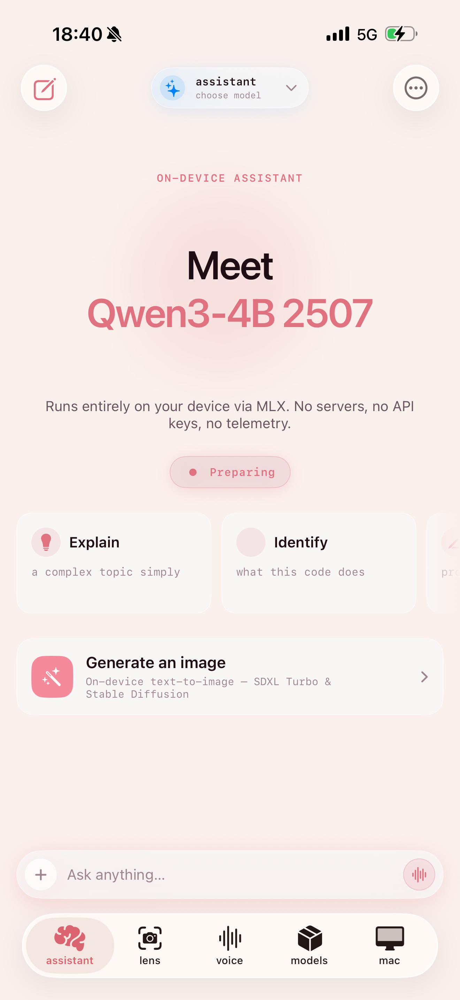
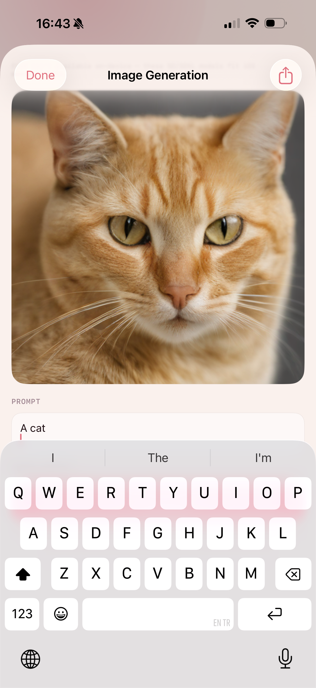
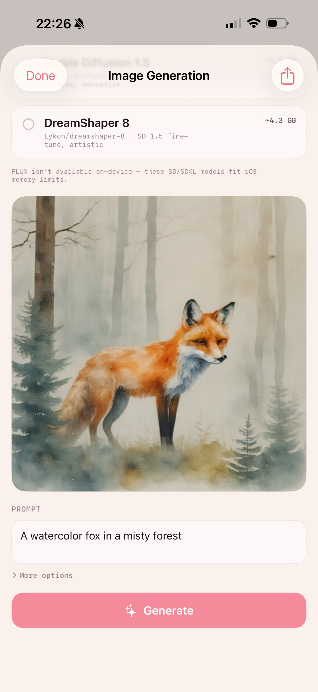
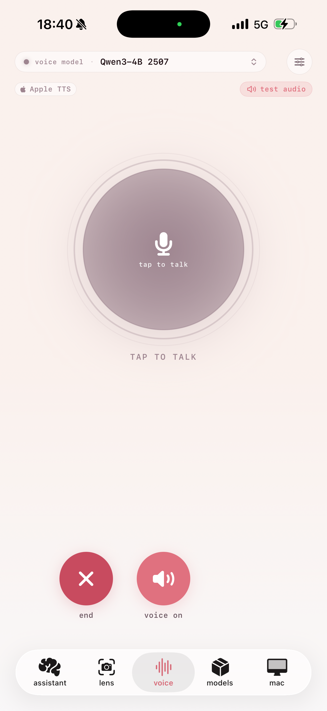
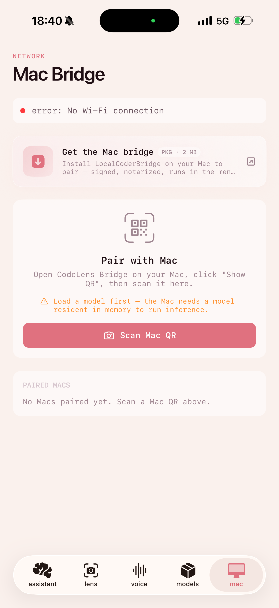

# iOS Local LLM User Guide — Complete On-Device AI Workspace Manual

Welcome to the **iOS Local LLM User Guide**. This document serves as a comprehensive manual detailing every tab, menu, setting, and feature of iOS Local LLM.

iOS Local LLM is a local-first, privacy-respecting AI studio built specifically for macOS and iOS. It runs third-party language models (LLMs) and vision-language models (VLMs) directly on your device's hardware using Apple's **MLX framework**, Core ML, and local native runtimes. It requires no iOS Local LLM account and includes no project-operated telemetry. Model downloads, optional web search, iCloud sync, and local bridge features use the network only when you enable or request them.

---

## Table of Contents
1. [Core Features & Architecture](#1-core-features--architecture)
2. [Home Tab: Dashboard & Status Hub](#2-home-tab-dashboard--status-hub)
3. [Assistant Tab: Interactive Chat & Power Tools](#3-assistant-tab-interactive-chat--power-tools)
4. [Lens Tab: Real-Time Vision & Code Capture](#4-lens-tab-real-time-vision--code-capture)
5. [Voice Tab: Hands-Free AI Conversation](#5-voice-tab-hands-free-ai-conversation)
6. [Models Tab: Model Download & Management Library](#6-models-tab-model-download--management-library)
7. [Mac Bridge: Desktop Pairing & Local Inference Hosting](#7-mac-bridge-desktop-pairing--local-inference-hosting)
8. [Settings: Preferences & System Controls](#8-settings-preferences--system-controls)

---

## 1. Core Features & Architecture

iOS Local LLM is designed to maximize local hardware capabilities while maintaining a strict zero-data-collection posture.

### Technology Blueprint
* **Inference Engine**: Employs the Apple MLX Swift wrapper for native Apple Silicon optimization, allowing LLMs (like Qwen 2.5 Coder or Llama 3.2) and VLMs (like SmolVLM 2.2B) to execute at maximum tokens-per-second on-device.
* **Unified Model Residency**: Uses an automatic unload/load cycle during tab changes. Large language models and vision models are loaded on-demand and unloaded when leaving tabs (e.g., swapping to Lens unloads the Chat LLM) to prevent memory allocation overruns (exceeding iOS's 6 GB jetsam ceiling).
* **Metal/GPU Safety**: Listens to app lifecycle states (`willResignActive` & backgrounding) to immediately suspend active GPU queue submissions, preventing background execution violations that trigger system termination.

---

## 2. Home Tab: Dashboard & Status Hub

The **Home Tab** acts as the launchpad and central status dashboard for iOS Local LLM.

### Main Functions
* **Greeting & Quick-Launch Hero Card**: Surfaces a real-time status of the loaded Assistant Model (e.g., *Ready*, *Thinking*, *Preparing*, or *Needs Setup*). Allows starting a **New Chat** or accessing **Voice mode** with a single tap.
* **Quick Action Grid**: Quick shortcuts to deep link into the **Lens** (camera), **Voice** (dictation), or **Mac** (pairing sheet) views.
* **Recent Conversations**: Lists the last three active chat threads with titles and relative time stamps, allowing you to jump back into a conversation.
* **Privacy Summary Card**: Displays the number of downloaded models and total local storage usage on your device, with a direct link to the **Models Hub**.
* **Settings Gear Access**: The avatar/gear icon in the top-right opens the application preferences.

---

## 3. Assistant Tab: Interactive Chat & Power Tools

The **Assistant Tab** is a fully-featured local chat interface powered by your choice of on-device LLM.

*Figure 1: The Assistant tab home view, presenting a clean landing interface with model status indicator and quick starting cards.*

### Landing Interface vs. Active Chat
* **Landing Route**: Welcomes you with a clean interface displaying the currently active model (e.g., `Qwen3-4B`), suggestion cards (e.g., *"Explain a complex topic"* or *"Identify what this code does"*), and a collapsed **Ask anything...** pill.
* **Chat Route**: Standard message bubbles featuring markdown formatting, syntax highlighting for code blocks, and inline buttons.

### Message & Bubble Actions
* **Copy Text**: Copies the plain text content of any message.
* **Edit & Resend**: Prefills your input editor with a previous user prompt so you can refine and resend.
* **Regenerate**: Discards the last assistant turn and re-runs generation using the same context.
* **Follow-up Chips**: Displays quick follow-up prompt templates at the end of the final assistant response (e.g., *"Explain more"*, *"Shorter version"*, *"Format as code"*).

### Composer Input & Attachments Bar
* **Voice Dictation**: Tap the mic button to speak your prompt instead of typing.
* **Photo Picker**: Attach one or more images for vision models to analyze.
* **Document Picker**: Attach text files, log files, or code repositories to inspect.
* **Snippet Manager**: Access a card listing saved prompt templates to quickly insert boilerplate text into the input field.

### Interactive Chat Overflow Options
Click the ellipsis icon (`...`) in the top right to access advanced power tools:
1. **Voice Conversation**: Full-screen hands-free talk interface.
2. **Image Generation**: Generates high-quality images locally on your device (see details below).
3. **Past Conversations**: Swap between saved chats, search conversation histories, or export chat threads to markdown files.
4. **Mac Bridge Status**: Inspect paired Mac connection latency or trigger a ping request.
5. **Persona Selector**: Swap active system instructions (e.g., switching between a *Software Engineer*, *Technical Educator*, or *System Administrator*).
6. **Web Search Options**: Toggle the web browsing agent (Web Tool) on/off or configure confirmation rules.
7. **Model Benchmarks**: Run performance suites to measure hardware limits.
8. **A/B Model Comparison**: Test two models side-by-side.
9. **Macros Runner**: Execute multi-prompt chains sequentially (e.g., `Review Code` ➔ `Write Tests` ➔ `Format`).

### On-Device Image Generation
iOS Local LLM features a fully local image generation engine that fits within iOS memory budgets, avoiding heavy, server-only engines like FLUX in favor of highly optimized SD 1.5, SDXL Turbo, and Stable Diffusion models.

| Image Generation Prompting | Advanced Options |
|---|---|
|    *Figure 2: Writing a text prompt for image generation.* |    *Figure 3: Image generation model selector (e.g., DreamShaper 8) and advanced settings.* |

* **Model Options**: Pick models like `DreamShaper 8` (Lykon/dreamshaper-8 SD 1.5 fine-tune) optimized to generate images under strict local RAM limits.
* **Advanced Adjustments**: Define **negative prompts** (elements to avoid) and adjust the generation **steps** slider (higher values add detail but require more processing time).
* **Export**: Generated images can be saved to your photo library or shared via standard iOS share sheets.

---

## 4. Lens Tab: Real-Time Vision & Code Capture

The **Lens Tab** utilizes the device camera to read, OCR, and analyze documents, screens, and environments in real time.

*Figure 4: The Lens tab executing live analysis on an open laptop. Features live video feedback, a text response card, and camera adjustments.*

### Camera Controls & Views
* **Viewfinder & Focus**: Full-screen preview with tap-to-focus and pinch-to-zoom gestures.
* **HUD Top Strip**: Shows model status color indicators, selected VLM model label, current pipeline FPS, and current background status details (e.g., *Analyzing...*).
* **Model Switcher Menu**: Tap the top strip to quickly toggle between built-in FastVLM and downloaded VLMs (like SmolVLM2), or navigate to the visual catalog.
* **Describe Interval Controls**: Set the follow-up refresh frequency for visual descriptions (from `6 seconds` to `30 seconds`) using `-` and `+` buttons. Tap the refresh icon for an on-demand description.
* **Camera Settings**: Quick toggles for flash/torch, access to history, and document scanning.

### Lens Modes (Configured in Settings)
1. **Code Mode (Default)**:
   * Point the camera at a screen or whiteboard containing source code.
   * Tap the capture shutter to snap a still.
   * The app performs a high-fidelity Apple Vision OCR pass to extract the code.
   * Renders the code in a clean text block and passes it to the reasoning LLM for structural analysis, linting, or explanation.
2. **Visual Mode (Multimodal)**:
   * Point the camera at any scene.
   * The active VLM model (built-in FastVLM or SmolVLM) streams a text description of the environment, screen, layout, or objects directly onto the viewport card.

> [!NOTE]
> **VLM Preprocessing & Aspect Ratios**: To avoid model errors and hallucinations, the image pipeline uses four distinct scaling strategies based on model architecture: `.fixed` (for Moondream2/PaliGemma), `.dynamicPatchAligned` (for Qwen2-VL), `.anyresTiling` (for LLaVA 1.6), and `.fixedTiling` (for SmolVLM).

---

## 5. Voice Tab: Hands-Free AI Conversation

The **Voice Tab** enables conversational interaction with your active local model.

*Figure 5: The Voice mode interface showing the voice session orb, active model details, TTS selection, and control buttons.*

### Features
* **Voice Activity Detection (VAD)**: Intelligently monitors ambient audio to recognize when you speak, ignoring transient background noises or television speech.
* **Shared Audio Session**: Listens and speaks back using a single synchronized audio session, eliminating clipped starts or delayed audio replies.
* **Text-to-Speech (TTS) Choice**: Select between Apple System voice synthesis or neural, on-device voice models (like *KittenTTS* or *Kokoro*).
* **Dictation Controls**: Press the central action orb to manually toggle speech sessions, test audio latency, or exit the voice loop.

---

## 6. Models Tab: Model Download & Management Library

The **Models Tab** serves as the central manager for downloading, updating, configuring, and deleting models.

### Role-Segmented Hub
Instead of listing everything in one flat list, models are organized by their specific application categories:
1. **Assistant**: Models optimized for reasoning, chat, and programming (Qwen, Llama, Phi, Gemma).
2. **Lens**: Multi-modal models capable of image analysis (SmolVLM, FastVLM).
3. **Voice**: Text-to-speech voice models (KittenTTS, Kokoro).
4. **Image**: Text-to-image diffusion models (DreamShaper, Stable Diffusion).

### Model Metrics & Actions
* **Disk Allocation Segment Bar**: Shows an at-a-glance visualization of your device's storage consumption, split by Language, Vision, and Voice files.
* **Live Status Badge**: Indicates the status of each model (e.g., *Ready*, *Downloading...*, *Not Loaded*, or *Error*).
* **Hugging Face Search**: An inline search bar allows searching the Hugging Face repository, enabling you to download any custom model file structure directly.
* **Swap / Load Actions**: Easily swap models, load them into active memory, or unload them to free system RAM.
* **Import Local Model**: Import custom MLX files or GGUF weights directly from the iOS Files application.
* **Clean Up Space**: Reclaims disk space by removing orphaned, partial, or failed downloads.

---

## 7. Mac Bridge: Desktop Pairing & Local Inference Hosting

The **Mac Bridge** allows you to pair your Mac with your iOS device.

*Figure 6: Mac Bridge configuration screen showing network options, pairing QR instructions, and active connections.*

### Integration Architecture
* **LocalCoderBridge**: Downloads a light desktop package (`LocalCoderBridge.pkg`) on your Mac that runs in the menu bar.
* **Pairing Flow**: Tap **Scan Mac QR** and point the phone at the QR code displayed on the Mac desktop screen. The devices establish a local network link.
* **iPhone as Server**: When paired, the Mac can offload inference tasks to the iPhone's Neural Engine. Alternatively, the Mac can stream screen data, Xcode logs, simulator framecrops, or terminal layouts to the iOS VLM to analyze code and verify layouts.

---

## 8. Settings: Preferences & System Controls

The **Settings menu** is split into six logical preferences screens to maintain a clean layout.

### Preferences Categories
1. **Capture & Lens**:
   * Toggle default Lens analysis mode (Code reviewer vs. Visual descriptive VLM).
2. **Models & AI**:
   * Access Gated Hugging Face repositories securely by adding your HF token to the iOS Keychain.
   * Manage advanced AI parameters: strict memory gates, loading timeout intervals, OCR fallback toggles, and FastVLM model sub-component statuses.
3. **Voice**:
   * Switch TTS engines between Apple System, KittenTTS, and Kokoro.
   * Toggle speech-to-text (STT) providers (e.g., native transcription vs. a local Whisper model).
   * Toggle **auto-read results** to make the assistant automatically speak its text responses.
4. **Appearance**:
   * Toggle Dark/Light themes.
   * Pick custom brand accent colors (Rose, Blue, Green, Purple, Orange, etc.).
   * Change interface localizations (English, Spanish, Turkish, etc.).
   * Enable/disable UI haptics and frame rate (FPS) counters.
   * Reset onboarding hints and tips.
5. **System & Diagnostics**:
   * View diagnostics, memory allocation logs, and Neural Engine capabilities.
   * Monitor battery heat level and toggle thermal throttling rules.
6. **Privacy & Legal**:
   * Perform a **one-tap wipe** of all local files, logs, and conversations.
   * Read licensing agreements and privacy declarations.
